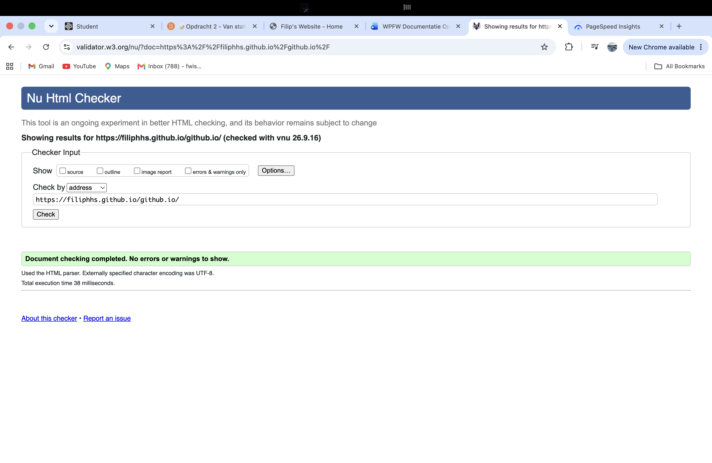
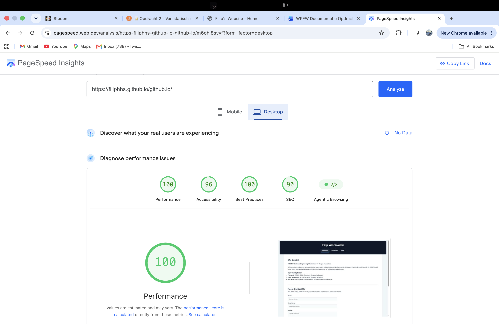

Gebruikersscenario's 

Persona en context: Een IT-recruiter opent het portfolio van Filip op een smartphone tijdens het beoordelen van binnengekomen sollicitaties voor een functie als Junior Web Developer. 

Doel: Binnen 10 seconden ontdekken wie Filip is en snel toetsen of zijn vaardigheden (zoals HTML5, CSS Flexbox en Git) aansluiten bij de eisen in de vacature. 

Actie op de site: 

De recruiter landt op de mobiele homepage en ziet direct bovenin de korte introductie en een overzicht van de vaardigheden zonder te hoeven scrollen. 

De recruiter klikt via het mobiele menu of de actieknop op de kaart naar Projecten om de technische uitwerking van een afgerond project te bekijken. 

De recruiter klikt door naar de GitHub-repository om de codekwaliteit te controleren. 

Gewenst resultaat: Een mobielvriendelijke en snel navigeerbare ervaring waarbij de recruiter binnen 30 seconden genoeg bewijs heeft om Filip uit te nodigen voor een gesprek. 

 

Scenario 2: Docent / Beoordelaar op desktop 

Een docent opent het portfolio op een laptop om de code, structuur en uitwerking te controleren met de rubric. De docent wil eenvoudig tussen alle pagina's kunnen navigeren en verwacht dat artikelen en blogposts overzichtelijk zijn ingedeeld. 

Onderbouwing Ontwerpkeuzes & Bronnen 

De keuze voor een semantische HTML5-structuur (`<header>`, `<main>`, `<article>`) zorgt voor een logische opbouw en optimale toegankelijkheid. Dit ondersteunt Scenario 2 (docent op desktop die de structuur beoordeeld) en helpt schermlezers, conform MDN Web Docs - HTML Semantics. 

Voor Scenario 1 (mobiel) is een Mobile-First Flexbox layout toegepast (`display: flex`, `flex-wrap: wrap`). Dit voorkomt horizontaal scrollen op kleine schermen en laat elementen op grotere schermen automatisch naast elkaar schalen, zoals beschreven op MDN Web Docs - Basic concepts of flexbox. 

Tot slot garandeert het sterke WCAG AA kleurcontrast donkerblauw #1a252f met lichte tekst uitstekende leesbaarheid onder alle omstandigheden voor beide scenario's, volgens de standaarden van MDN Web Docs - Color contrast. 

